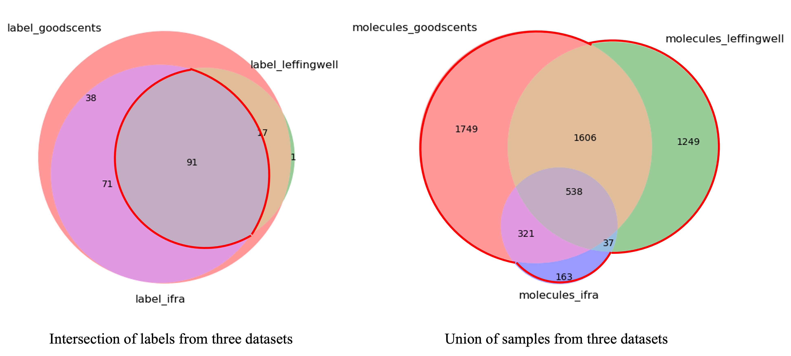
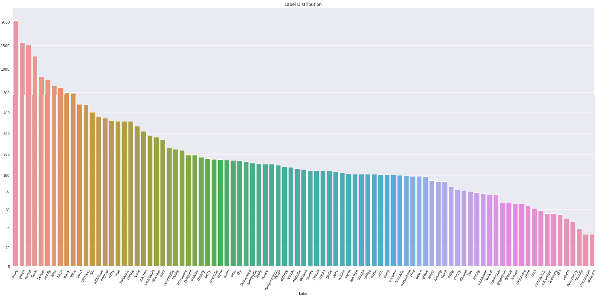

README
===========================

Olfactory

## Contents

* [Data Curation](#DataCuration)
    * Expert-Labeled Dataset
    * Unannotated large-scale molecular datasets
* [Featurization And Preprocessing](#Featurization)
    * Featurization of Molecules
    * Second-order IterativeStratification for Dataset Spliting
* [Models](#Models)
    * MPNN Model for Graph Features

## Data Curation
### Expert-Labeled Dataset
We assembled an expert-labeled set of 5596 molecules from three separate sources in [Pyrfume](https://github.com/pyrfume) Project: the [GoodScents](https://github.com/pyrfume/pyrfume-data/tree/main/goodscents) database (n = 6157), the [Leffingwell PMP 2001](https://github.com/pyrfume/pyrfume-data/tree/main/leffingwell) database (n = 3523), and the [Ifra 2019](https://github.com/pyrfume/pyrfume-data/tree/main/ifra_2019) database (n = 1135).

For each sources, molecules are labeled with one or more odor descriptors by olfactory experts. GoodScents describes a list of 1–15 odor descriptors for each molecule, whereas Ifra describes a list of 1–3 odor descriptors. And Leffingwell uses free-form text. Considering the following five kinds of problems with the odor descriptor, we manually calibrated the descriptors via different strategies.

|Type of Problem|Example|Strategy|
|----|-----|-----|
|Synonymous|‘cedar’ / ‘cedarwood’|unify|
|Mixed|‘toasted meat’|discard|
|Incomprehensible|‘white’|discard|
|Too broad|‘nice’|refer to Google's work|
|Chemical|‘pyrazine’|refer to Google's work|

The statistics of the calibrated dataset are as follows,
|Dataset|Number of molecules|Number of original labels|Number of calibrated labels|
|----|-----|-----|----|
|Goodscents|6157 to 6128|679|217||
|Leffingwell|3523 to 3430|114|109|
|Ifra|1135|190|162|

The calibrated datasets share overlapping molecules and odor descriptors. We retained the odor descriptors that co-occurred in the three datasets to ensure the reliability of the labels for the fixed dataset. And all the unique molecules were incorporating, while overlapping molecules inherited the union of both datasets’ odor descriptors.

The label distribution of the fixed experimental dataset from three separate sources is shown in Figure. We left only odor descriptors with at least 30 representative molecules. 
(some oversized molecules were deleted, 11980947,5287407,24238,44475014,62074,11686063,133082064,16211610,173849,CID23308253,24753271)

### Unannotated large-scale molecular datasets
The QM9 dataset includes the composition of 130,000 organic molecules, spatial information and their corresponding properties. QM9 is a subset of the GBD13 dataset, which contains 975 million molecules. We extracted molecules in the form of SMILES from QM9 and GBD13, respectively, and left them for later unsupervised learning tasks.

## Featurization And Preprocessing

### Featurization of Molecules
We proposed that befitting data representation and customized deep models can improve model performance and provide generalization.
For each molecule, we stored the data in the form of SMILES. The numeric features were extracted by [Mordred](https://github.com/mordred-descriptor/mordred) (Open Source), while The text and graph features are calculated with the RDkit toolkit.

Stats for different features (dimensions).

### Second-order IterativeStratification for Dataset Spliting
Some odor descriptors were extremely common, like fruity or green, while others were rare, like radish or bready. Because of the common sense intuition that odor descriptors are similar and dissimilar, odor descriptors exhibit an extremely strong co-occurrence with each other. At the same time, because the label distribution is extremely different, we need fit dataset spliting methods. We used the same [Second-order IterativeStratification](https://arxiv.org/abs/1704.08756) as benchwork

## Models
Parameters:
    Namespace(batch_size=10, no_cuda=False, epochs=300, lr=0.0001, lr_decay=0.5, schedule=[0.1, 0.9], momentum=0.9, log_interval=100, prefetch=4, model='MLP')

### MPNN Model for Graph Features

    $ python main.py --model 'MPNN'
    
 Reference: https://github.com/ifding

 ### MLP for Numeric Features
 
    $ python main.py --model 'MLP'
 
 dat_CID_mordred could be accessed via https://sonyjpn-my.sharepoint.com/:x:/g/personal/pei_gao_sony_com/ERY6fh3JQClFmz1WIFl_2TYBCSU8NPPAr2GZOtlfflrHBg?e=QcQGkp
